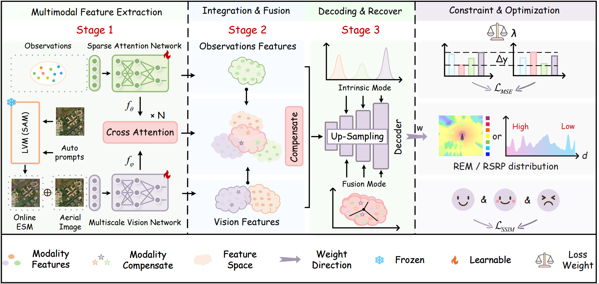

# Multimodal

# Practical Radio Environment Map Construction from Aerial Images: A Multimodal Method

## 🚀 Project Overview

Existing REM construction methods usually assume ideal prior information and propagation environments, making them difficult to adapt to data distortion and environmental variations in practical scenarios. To this end, this paper proposes a real-world REM construction method that uses practically available multi-source heterogeneous data, in-cluding aerial images and sensing observations, to obtain REMs under non-ideal environmental priors and channel conditions. 

## 📂 Datasets

### 🔹 Cellular Radio

stored in Folder 📂(data) including Air and Land scenario

---

## 🙌 Acknowledgments

Our work is based on:

- [REM-NET+](https://github.com/YNUniversityCQ/REM-NET)
- [DRSformer](https://github.com/cschenxiang/DRSformer)
- [SAM](https://github.com/facebookresearch/segment-anything)

---

## 📧 Contact

For inquiries, please contact **Chen Qi** at [chenqi_7oou@stu.ynu.edu.cn](chenqi_7oou@stu.ynu.edu.cn).

